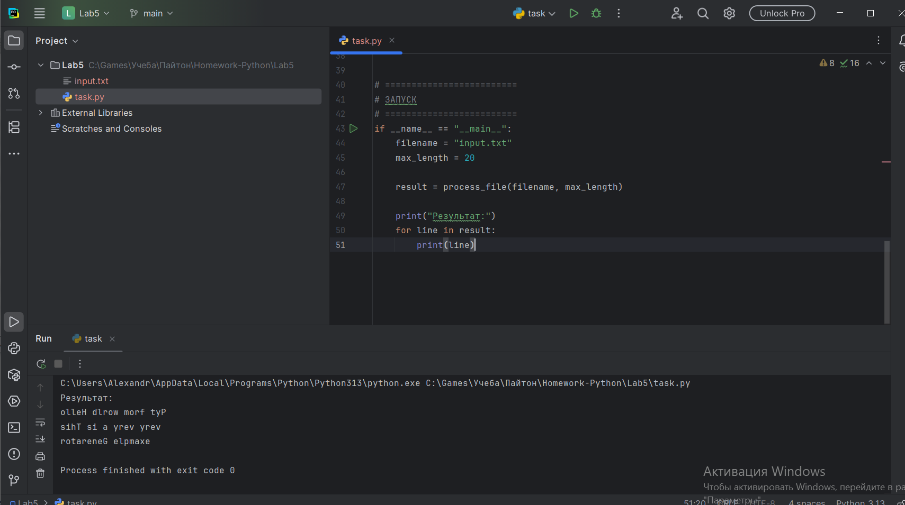

# Лабораторная работа №5 (Генераторы, Python)

## Условия задач

Реализовать генератор для построчного чтения файла.  
Если длина строки превышает заданный предел, генератор должен возвращать подстроку допустимого размера.

Дополнительно:
- перевернуть слова в строках, возвращаемых генератором
- применить к генератору одну из функций: map, filter или reduce

---

## Описание проделанной работы

В ходе выполнения лабораторной работы:

- реализован генератор для построчного чтения файла с использованием оператора yield
- добавлена проверка длины строки и её обрезка при превышении заданного лимита
- реализована функция для переворота слов в строке
- применена функция map для обработки данных, возвращаемых генератором

### Использованные технологии:

- генераторы (yield)
- функции высшего порядка (map)
- работа с файлами
- обработка строк

---

## Скриншоты результатов

Скриншоты выполнения программы находятся в папке:

lab5/screenshots/

---

## Используемые материалы

https://docs.python.org/3/  
https://docs.python.org/3/tutorial/inputoutput.html  
https://docs.python.org/3/library/functions.html#map  
https://habr.com/ru/post/337314/  

---

## Вывод

В результате выполнения лабораторной работы были изучены генераторы и их применение для обработки данных. Получены навыки работы с файлами, строками и функциями высшего порядка в Python.
