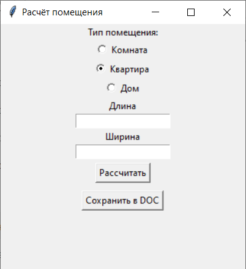
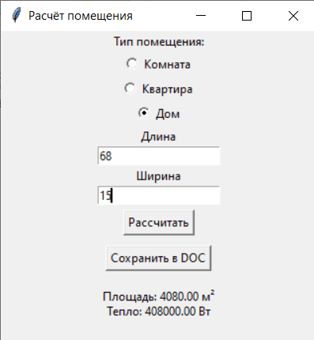
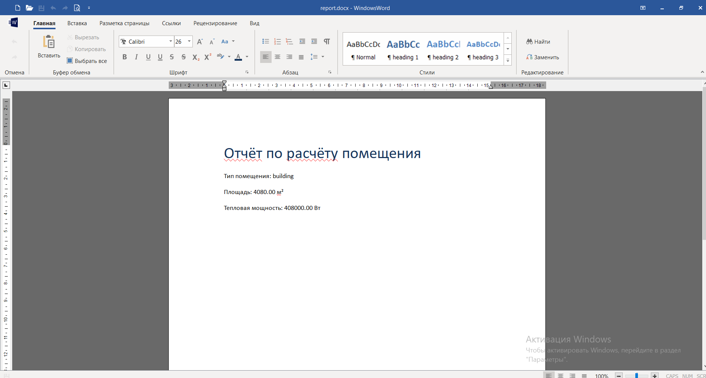

# Лабораторная работа №6 (Модули, пакеты, GUI, Python)

## Условия задач

Создать пакет, содержащий 3 модуля, и подключить его к основной программе.

Основная программа должна:
- иметь графический пользовательский интерфейс (GUI)
- позволять вводить параметры
- отображать результаты вычислений
- сохранять результаты в файл формата .doc или .xls

Задание:  
Реализовать расчёт площади помещения и тепловой мощности для обогрева.

Типы помещений:
- комната
- квартира
- многоэтажный дом

---

## Описание проделанной работы

В ходе выполнения лабораторной работы:

- создан пакет `building`, содержащий три модуля:
  - `room.py` — расчёт площади и тепловой мощности комнаты
  - `apartment.py` — расчёт для квартиры
  - `building.py` — расчёт для дома
- реализована программа `main.py` с графическим интерфейсом (Tkinter)
- добавлен выбор типа помещения (комната, квартира, дом)
- реализован ввод параметров (длина и ширина)
- выполнен расчёт площади и тепловой мощности
- реализовано сохранение результата в файл `.docx` с помощью библиотеки `python-docx`

---

## Скриншоты результатов

Скриншоты находятся в папке:

lab6/screenshots/

### 1. Графический интерфейс программы

### 2. Результат вычислений

### 3. Сохранённый файл отчёта

---

## Структура проекта

lab6/
 ├── main.py
 ├── building/
 │    ├── __init__.py
 │    ├── room.py
 │    ├── apartment.py
 │    └── building.py
 ├── screenshots/
 │    ├── gui.png
 │    ├── result.png
 │    └── file.png
 └── README.md

---

## Используемые материалы

https://docs.python.org/3/  
https://docs.python.org/3/library/tkinter.html  
https://python-docx.readthedocs.io/  
https://habr.com/ru/post/149854/  

---

## Вывод

В результате выполнения лабораторной работы были изучены принципы создания пакетов и модулей в Python, разработан графический интерфейс пользователя и реализовано сохранение результатов в файл. Получены практические навыки разработки приложений с GUI.
