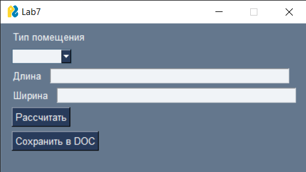
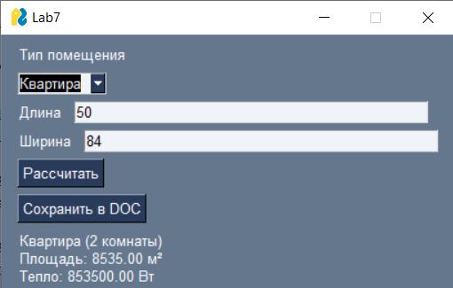
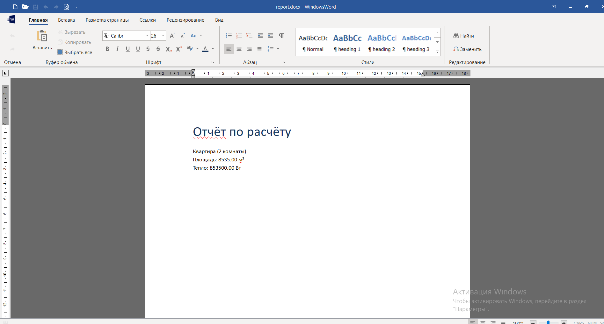

# Лабораторная работа №7 (ООП: классы и объекты, Python)

## Условия задач

Переписать лабораторную работу №6 с использованием объектно-ориентированного программирования.

Требования:
- использование абстрактного базового класса
- использование декораторов @abstractmethod
- реализация иерархии наследования
- использование managed-атрибутов (@property)
- использование минимум 2 dunder-методов в каждом классе
- использование графического интерфейса (GUI), отличного от предыдущей работы
- возможность сохранения результатов в файл формата .doc или .xls

Задание:
Реализовать расчёт площади помещения и тепловой мощности для обогрева.

Типы помещений:
- комната
- квартира
- дом

---

## Описание проделанной работы

В ходе выполнения лабораторной работы:

- реализован абстрактный базовый класс `Building` с методами `area()` и `heat()`
- создана иерархия классов:
  - `Room` — комната
  - `Apartment` — квартира (содержит список комнат)
  - `House` — дом (содержит список квартир)
- реализованы managed-атрибуты с помощью декоратора `@property`
- реализованы dunder-методы (`__str__`, `__len__`) в каждом классе
- разработан графический интерфейс с использованием **PySimpleGUI**
- реализован ввод параметров пользователем
- реализован расчёт площади и тепловой мощности
- добавлена возможность сохранения результатов в файл `.docx` с использованием библиотеки `python-docx`

### Логика работы программы:

1. Пользователь выбирает тип помещения
2. Вводит длину и ширину
3. Создаётся объект соответствующего класса
4. Выполняется расчёт площади и тепловой мощности
5. Результат отображается в интерфейсе
6. Результат можно сохранить в файл `report.docx`

---

## Скриншоты результатов

Скриншоты находятся в папке:

lab7/screenshots/

### 1. Графический интерфейс программы

### 2. Результат расчёта (пример: квартира)

### 3. Сохранённый файл отчёта

---

## Структура проекта

lab7/
 ├── task.py
 ├── screenshots/
 │    ├── gui.png
 │    ├── apartment.png
 │    └── doc.png
 └── README.md

---

## Используемые материалы

https://docs.python.org/3/  
https://docs.python.org/3/library/abc.html  
https://pysimplegui.readthedocs.io/  
https://python-docx.readthedocs.io/  
https://habr.com/ru/post/145835/  

---

## Вывод

В результате выполнения лабораторной работы были изучены принципы объектно-ориентированного программирования, включая абстрактные классы, наследование и инкапсуляцию. Также были получены навыки разработки графических интерфейсов и сохранения данных в файл.
