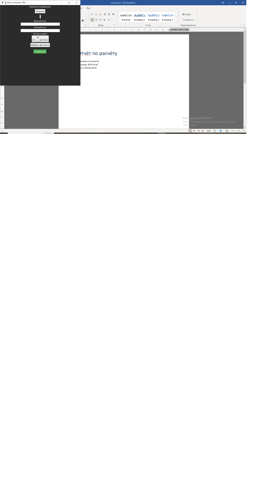
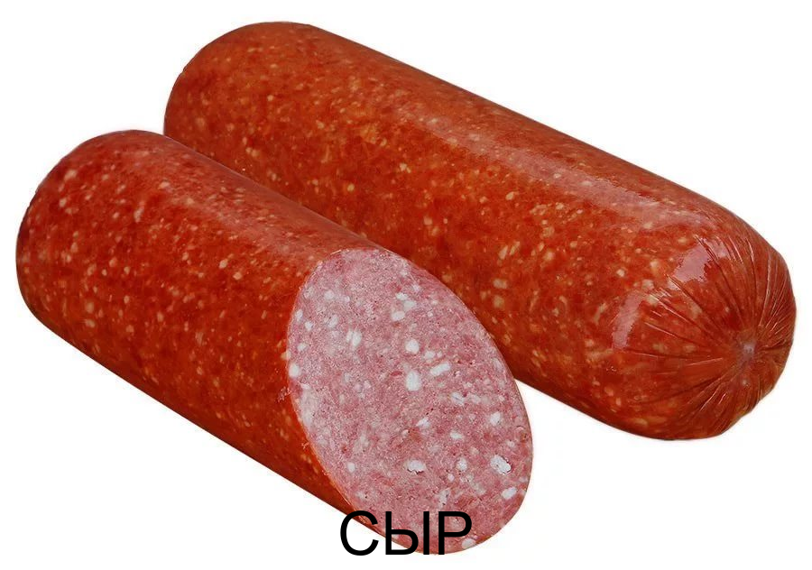

# Лабораторная работа №8  
## Генератор мемов (Meme Generator PRO)

---

## Название приложения

Meme Generator PRO

---

## Описание

Приложение предназначено для создания мемов на основе изображений.  
Пользователь может загрузить картинку, добавить текст сверху и снизу, выбрать цвет и размер шрифта, после чего сохранить результат.

---

## Функциональные возможности

- загрузка изображения
- ввод текста (верх/низ)
- выбор цвета текста
- настройка размера шрифта
- предпросмотр изображения
- создание мема
- сохранение в файл (meme_result.png)
- обработка ошибок через собственное исключение

---

## Используемые технологии

- Python 3
- Tkinter
- Pillow
- ООП (классы и объекты)

---

## Описание реализации

В программе реализован класс MemeGenerator, который отвечает за:
- загрузку изображения
- создание мема
- сохранение результата

Создано пользовательское исключение MemeError, которое используется:
- если файл не выбран
- если изображение не загружено

Исключения обрабатываются через try/except и выводятся в интерфейсе.

---

## Инструкция по запуску

1. Установить библиотеку:

pip install pillow

2. Запустить программу:

python task.py

---

## Скриншоты

### Главное окно

### Процесс создания

### Результат

---

## Структура проекта

lab8/
 ├── task.py
 ├── screenshots/
 │    ├── gui.png
 │    ├── process.png
 │    └── result.png
 └── README.md

---

## Используемые материалы

https://docs.python.org/3/  
https://docs.python.org/3/library/tkinter.html  
https://pillow.readthedocs.io/  

---

## Вывод

В ходе работы было создано GUI-приложение с использованием ООП и пользовательских исключений. Программа позволяет генерировать мемы и сохранять результат.